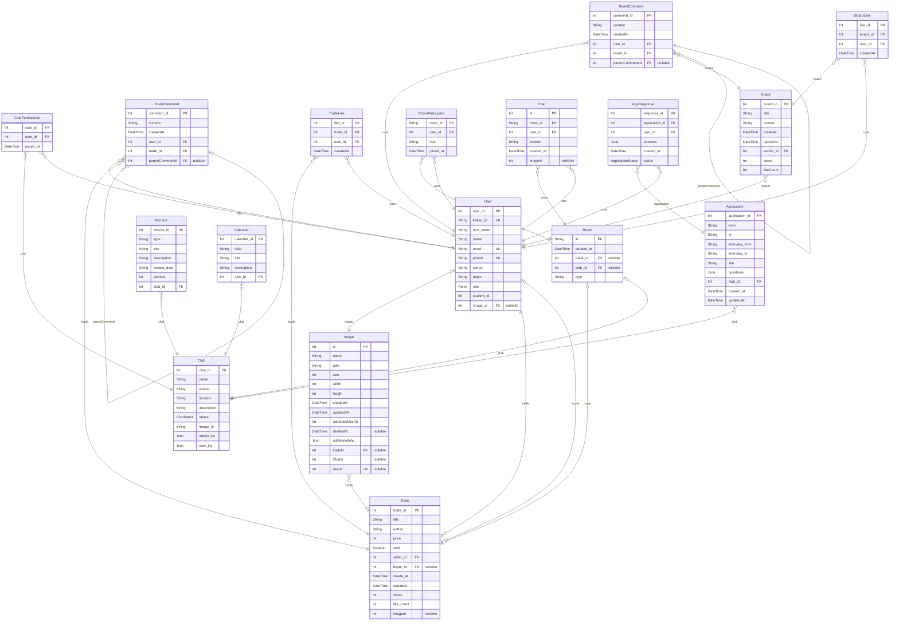

# Sinchon ICPC Camp ERD
> Generated by [`prisma-markdown`](https://github.com/samchon/prisma-markdown)

- [default](#default)

## default

### `User`

**Properties**
  - `user_id`: 
  - `kakao_id`: 
  - `nick_name`: 
  - `name`: 
  - `email`: 
  - `phone`: 
  - `school`: 
  - `major`: 
  - `role`: 
  - `student_id`: 
  - `image_id`: 

### `Trade`

**Properties**
  - `trade_id`: 
  - `title`: 
  - `author`: 
  - `price`: 
  - `sold`: 
  - `seller_id`: 
  - `buyer_id`: 
  - `create_at`: 
  - `updateAt`: 
  - `views`: 
  - `like_count`: 
  - `imageId`: 

### `Club`

**Properties**
  - `club_id`: 
  - `name`: 
  - `school`: 
  - `location`: 
  - `description`: 
  - `status`: 
  - `image_url`: 
  - `admin_list`: 
  - `user_list`: 

### `ClubParticipants`

**Properties**
  - `club_id`: 
  - `user_id`: 
  - `joined_at`: 

### `TradeComment`

**Properties**
  - `comment_id`: 
  - `content`: 
  - `createdAt`: 
  - `user_id`: 
  - `trade_id`: 
  - `parentCommentId`: 

### `TradeLike`

**Properties**
  - `like_id`: 
  - `trade_id`: 
  - `user_id`: 
  - `createdAt`: 

### `Board`

**Properties**
  - `board_id`: 
  - `title`: 
  - `content`: 
  - `createAt`: 
  - `updateAt`: 
  - `author_id`: 
  - `views`: 
  - `likeCount`: 

### `BoardComment`

**Properties**
  - `comment_id`: 
  - `content`: 
  - `createdAt`: 
  - `user_id`: 
  - `board_id`: 
  - `parentCommentId`: 

### `BoardLike`

**Properties**
  - `like_id`: 
  - `board_id`: 
  - `user_id`: 
  - `createdAt`: 

### `Room`

**Properties**
  - `id`: 
  - `created_at`: 
  - `trade_id`: 
  - `club_id`: 
  - `type`: 

### `RoomParticipant`

**Properties**
  - `room_id`: 
  - `user_id`: 
  - `role`: 
  - `joined_at`: 

### `Chat`

**Properties**
  - `id`: 
  - `room_id`: 
  - `user_id`: 
  - `content`: 
  - `created_at`: 
  - `imageId`: 

### `Image`

**Properties**
  - `id`: 
  - `name`: 
  - `path`: 
  - `size`: 
  - `width`: 
  - `height`: 
  - `createdAt`: 
  - `updatedAt`: 
  - `uploadedUserId`: 
  - `deletedAt`: 
  - `additionalInfo`: 
  - `tradeId`: 
  - `ChatId`: 
  - `userId`: 

### `Application`

**Properties**
  - `application_id`: 
  - `from`: 
  - `to`: 
  - `interview_from`: 
  - `interview_to`: 
  - `title`: 
  - `questions`: 
  - `club_id`: 
  - `created_at`: 
  - `updatedAt`: 

### `AppResponse`

**Properties**
  - `response_id`: 
  - `application_id`: 
  - `user_id`: 
  - `answers`: 
  - `created_at`: 
  - `status`: 

### `Receipt`

**Properties**
  - `receipt_id`: 
  - `type`: 
  - `title`: 
  - `description`: 
  - `receipt_date`: 
  - `amount`: 
  - `club_id`: 

### `Calendar`

**Properties**
  - `calendar_id`: 
  - `date`: 
  - `title`: 
  - `description`: 
  - `club_id`: 